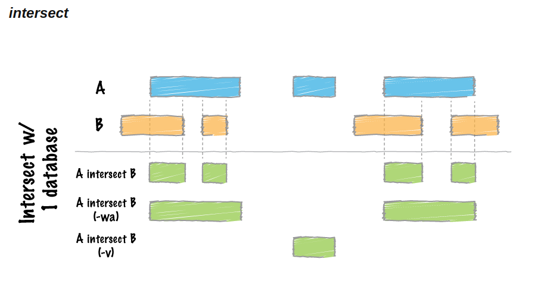

```{r,echo=FALSE}
htmltools::img(src = knitr::image_uri("images/micm_color_logo.png"), 
               alt = 'logo', 
               style = 'position:absolute; top:30px; right:0; padding:10px; max-width:50%;')
```

This workshop will guide you through the basics of ChIP-seq analysis with hands-on exercises. You will learn how to process ChIP-seq data: perform read alignment, peak calling, quality control, visualization through the genome browser, motif finding and gene set enrichment analysis.

In this tutorial, we are going to focus on peak calling. 

**Note**: All the code in this tutorial will be performed in the terminal. 

# 01 - Peak Calling with MACS

Let's move to the scripts directory (or stay here if already there):
```{bash, eval=F}
cd chip_seq/scripts
```

The main command that we are going to use with macs2 is the callpeak function. The manual can be found [here](https://pypi.org/project/MACS2/). 
```{bash}
macs2 callpeak --help
```
We will use the BAM file from our previous step, and an Input control BAM that has been already pre-processed. 
```{bash}
ls  ../data/Input_Rep1/
```
If you didn't compute the BAM for the alignment step, you can find it in here:
```{bash}
ls ../data/HIF1a_Rep1/HIF1a_Rep1.sorted.rmdup.bam
```
Let's create an output directory for storing MACS results
```{bash}
mkdir -p ../results/macs2
```
Now we are ready to call MACS
```{bash}
macs2 callpeak -t ../results/HIF1a_Rep1.sorted.rmdup.bam -c ../data/Input_Rep1/Input_Rep1.sorted.rmdup.bam -f BAMPE -g hs -n HIF1a_rep1 -q 0.05 --outdir ../results/macs2
```
* -t: treatment file. 
* -c: control file
* -f: Format of the tag file. Since our data is paired-end, we are using BAMPE. Note that by specifying that the data is paired-end, MACS will use the actual fragment size from the reads and will not estimate it. 
* -g: Effective genome size. It has presets for various genomes.
* -n: Experiment name, used for the output file names

Let's take a look at the MACS output:
```{bash}
ls ../results/macs2
```
The main result of macs will be a list of peaks called as statistically significant. The .xls file can be opened and explored with excel. The .narrowPeak is a BED6+4 format file that contains the peak locations together with peak summit, p-value, and q-value. The _summits.bed file is in BED format, which contains the peak summits locations for every peak. 
```{bash}
head ../results/macs2/HIF1a_rep1_peaks.narrowPeak
```
We can create a BED file by ommiting some columns(this will be useful for the next step).
```{bash}
cut -f 1-6 ../results/macs2/HIF1a_rep1_peaks.narrowPeak > ../results/macs2/HIF1a_rep1_peaks.bed
```
Column 9 represents the -log10qvalue at peak summit.
We can also take a look at the coordinates of the summits of the peaks ( regions of highest signal)
```{bash}
head ../results/macs2/HIF1a_rep1_summits.bed
```
We can also check the number of significant peaks called
```{bash}
wc -l ../results/macs2/HIF1a_rep1_peaks.narrowPeak
```
# 02 - Peak overlap between replicates

One of the most common problems in dealing with peaks in ChIP-seq analysis is to check if two sets of peaks overlap. To work through that, we are going to use bedtools intersect. You can find information about the tool in [here](https://bedtools.readthedocs.io/en/latest/content/tools/intersect.html). 



For this exercise, we are going the overlap between peaks called by MACS2 for two replicates, one of them is the one we have processed so far, and the other one can be found in the data folder
```{bash}
ls ../data/HIF1a_Rep2/macs2/
```
```{bash}
head ../data/HIF1a_Rep2/macs2/HIF1a_rep2_peaks.narrowPeak
```
Let's check the intersect between replicate 1 and replicate 2 with the default behaviour
```{bash}
bedtools intersect -a ../results/macs2/HIF1a_rep1_peaks.narrowPeak -b ../data/HIF1a_Rep2/macs2/HIF1a_rep2_peaks.narrowPeak
```
By default, if an overlap is found, bedtools intersect reports the shared interval between the two overlapping features.
We can also return not only the shared interval, but the original entries of A for the overlap:
```{bash}
bedtools intersect -a ../results/macs2/HIF1a_rep1_peaks.narrowPeak -b ../data/HIF1a_Rep2/macs2/HIF1a_rep2_peaks.narrowPeak -wa
```
# 03 - Exercises
 
* 1. Perform the peak calling steps for the HIF2a data. If you didn't complete the alignment step for HIF2a, a processed .bam file can be found in here: 
```{bash}
ls ../data/HIF2a_Rep1/HIF2a_Rep1.sorted.rmdup.bam
```
You can use the same input control as for HIF1a.

* 2. How would you run MACS without a input ChIP-seq control? Test this using the HIF1a data.

* 3. By default, bedtools intersect will report an overlap between A and B so long as there is at least one base pair is overlapping. What argument would you change to overlap by at least 50 percent? Test this using replicate 1 and replicate 2 of the HIF1a data. 

* 4. Compare the overlap between the HIF1a replicates and between HIF1a and HIF2a.

```{r}
sessionInfo()
```

